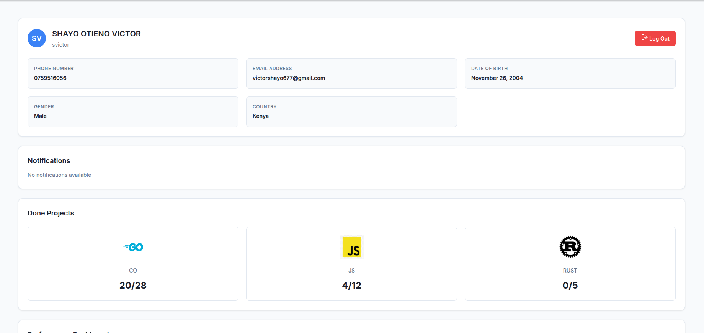

# GraphQL Profile Page

Welcome to the GraphQL Profile Page project! This application provides a clean and interactive UI to view user profile data from the Zone01 Kisumu platform, fetched using the power of GraphQL.



## 🚀 Overview

**[Live Demo](https://makebelief.github.io/graphql/)**

This project authenticates a user with Zone01 Kisumu, fetches their profile data—including identity, XP, skills, and audit performance—and presents it in a visually appealing and easy-to-understand dashboard.

- **GraphQL API Endpoint**: `https://learn.zone01kisumu.ke/api/graphql-engine/v1/graphql`
- **Authentication**: Uses a JWT Bearer Token obtained via the `/api/auth/signin` endpoint.

---

## ✨ Features

- **🔐 Secure User Authentication**: Login with username/password or email/password to get a secure JWT.
- **👤 Comprehensive Profile Display**: View username, full name, XP, level, skills, and detailed audit stats.
- **📊 Interactive Data Visualization**: Track XP progress over time and see a clear breakdown of your audit ratio with interactive charts.
- **☁️ Hosted & Accessible**: Deployed and publicly accessible for easy viewing.

---

## 🛠️ Getting Started

To get this project up and running on your local machine, follow these simple steps.

### Prerequisites

Make sure you have [Node.js](https://nodejs.org/) and [npm](https://www.npmjs.com/) installed.

### 1. Clone the Repository

```bash
git clone https://learn.zone01kisumu.ke/git/svictor/graphql.git
cd graphql
```

### 2. Install Dependencies

```bash
npm install
```

### 3. Run the Application

```bash
npm start
```

Your application should now be running on `http://localhost:3000` (or another specified port).

---

## 🤝 How to Collaborate

Contributions are what make the open-source community such an amazing place to learn, inspire, and create. Any contributions you make are **greatly appreciated**!

If you have a suggestion that would make this better, please fork the repo and create a pull request. You can also simply open an issue with the tag "enhancement".

1.  **Fork the Project**
2.  **Create your Feature Branch** (`git checkout -b feature/AmazingFeature`)
3.  **Commit your Changes** (`git commit -m 'feat: Add some AmazingFeature'`)
4.  **Push to the Branch** (`git push origin feature/AmazingFeature`)
5.  **Open a Pull Request**

---

## 👨‍💻 Author

This project was created and is maintained by **shayo victor**.

---

## 📄 License

This project is distributed under the MIT License. See the `LICENSE` file for more information.
